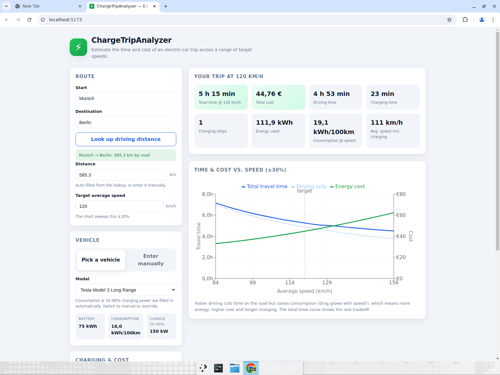

# ChargeTripAnalyzer

A small web app that estimates the **travel time** and **cost** of an
electric-car trip, and shows how both change as you vary your target speed by
±30%.



## What it does

- Enter a **start** and **destination**; the app looks up the real driving
  distance via OpenStreetMap (Nominatim geocoding) and OSRM routing. You can
  also type the distance in manually.
- Pick a **vehicle** from a built-in list — consumption (kWh/100km) and average
  10–80% charging power are filled in automatically — **or** switch to manual
  entry and provide consumption, charging power and battery capacity yourself.
- Set your **target average speed**, **electricity price (€/kWh)**, departure /
  reserve state-of-charge and per-stop overhead.
- See a summary for your chosen speed plus a chart of **total travel time** and
  **energy cost** across the target speed ±30%.

## The model

Total travel time = driving time + charging time.

- **Consumption vs. speed.** The consumption you enter (or that comes from the
  vehicle list) is treated as the value at a reference speed (100 km/h). The
  app scales it with a physics-based curve combining aerodynamic drag (∝ speed²),
  rolling resistance (≈ constant) and auxiliary loads (constant power, so larger
  per km at low speed). Driving faster therefore raises consumption.
- **Energy** = distance × consumption(speed) ÷ 100.
- **Charging energy** = energy beyond what the starting charge covers
  (`battery × (departureSoC − reserveSoC)`).
- **Charging time** = charging energy ÷ average 10–80% power, plus a fixed
  overhead per stop. The number of stops assumes each fast-charge session refills
  one 10→80% window.
- **Cost** = total energy × price per kWh.

Vehicle figures are approximate; they are sensible starting points, not exact
specs. Real-world results depend on weather, traffic, terrain, payload and
charger availability.

## Develop

```bash
npm install
npm run dev        # start the dev server
npm run build      # type-check + production build
npm run lint       # eslint
npm run typecheck  # tsc --noEmit
npm test           # vitest unit tests for the model
```

Built with React, TypeScript, Vite and Recharts.
